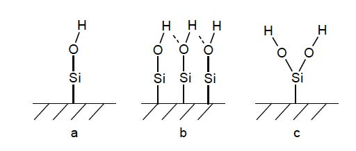

```{r setup, include=FALSE}
knitr::opts_chunk$set(echo = TRUE)
Sys.setenv(TZ="Africa/Johannesburg")
library(reedtemplates)
library(chemistr)
library(png)
library(jpeg)
library(captioner)
library(captioner)
fig_nums <- captioner()
table_nums <- captioner(prefix = "Table")
```

#####

# Abstract

Three $\alpha$-Quartz ,spacegroup 180, surfaces were modelled using crystallographic data from pearson…. obtained in the Medea package database. Surface planes with miller indexes 100, 110 and 200 were cut from the bulk structure. The different surfaces were compared to identify the ideal MCM-41 surface to be used as a catalyst support.

# Introduction

The utilisation of homogeneos catalysts in industry are limited, due to the fact that it is expensive to extract the catalyst from post-reaction mixtures [@RN44], [@RN90]. Research especialy in the pharmaseutlical and petrochemistry industries took an intrest in the imobilisation or heteroganasion of a homgeneous catalyst as a posible solution to the mentiond problem. 

Although the activity and selectivity of heterogeneous catalytic reactions are lower than homogeneous reactions,  the advantage of separation, recovery and recycling outweigh these shortcomings. It is however important to ensure that the effectiveness of the immobilized homogeneous catalyst is not dramatically compromised [@RN90], [@RN73]. Therefore the main objective in the successful immobilization of homogeneous catalyst systems is to combine the high activity and selectivity properties of homogeneous catalysts with the ease of recovery of a heterogeneous catalyst. To accomplish this the selection of an appropriate support material is very important [@RN90]. 

Support materials can be divided into three categories e.g. insoluble organic, polymeric or inorganic supports. Immobilization by using insoluble organic supports involves ultrafiltration techniques as seen in the separation of the PUK-Grubbs 2 catalyst by using organic solvent nanofiltration [@RN73]. Van der Gryp et al. [@RN73] performed this separation using organic membranes and discovered that the catalyst can be successfully separated, but its lifetime was dramatically decreased during the filtration process [@RN73], [@RN90]. Polymer supports on the other hand provide easier filtration techniques, multiple coordination sites and the possibility to incorporate a molecular catalyst into the polymer structure. These are great advantages, but during the filtration process the thermal stability remains low [@RN90]. Inorganic supports have a high thermal stability, it provides for multiple coordination sites because it contains a large surface area (BET), big pores and narrow pore size distributions. Therefore inorganic supports are more effective in the immobilization of homogeneous catalysts systems than organic or polymeric support surfaces.[@RN44]

There are three types of inorganic supports available, which is categorized by their pore sizes and physical compositions:

1. Inorganic microporous support materials have pore sizes < 2nm, e.g. Zeolites, Metal-Organic Frameworks (MOFs);
2. Inorganic mesoporous support materials have pore sizes in the range of 2-15 nm, e.g. MCM-41, SBA-15 and Aerogels; and 
3. Inorganic macroporous support materials have pore sizes greater than 50 nm, e.g. glasses. [@RN44], [@RN90] 

Although microporous and macroporious support materials have the ability to be used as heterogeneous support, it doesn’t have an industrial appeal yet [@RN44],[@RN90]. Therefore the focus is on mesoporous support materials. Since the successful synthesis of mesoporous materials by Mobil in 1992, the research field in using and synthesizing mesoporious materials as support materials for heterogeneous catalytic reactions has grown significantly. The original synthesis of mesoporous support material was defined as the M41S family containing hexagonal MCM-41, cubic MCM-48 and lamellar MCM-50 structures. A more visual representation of the different structures can be seen in `r fig_nums("intro1", display = "cite")`

```{r Image: Mesoporous structures, echo=FALSE, fig.align = 'center', message=FALSE, warning=FALSE, out.width='90%'}

# All defaults
knitr::include_graphics("Data/Images/Mcm-structures.jpg")
fig_nums("intro1", "Different structures of the M41S family", display = FALSE)

```

####### `r fig_nums("intro1")` [@RN87]

Unfortunately M41S materials have a limitation in pore diameter, approximately 80 Å, which affects the separation of large molecules [@RN89]. Zhao et al. [@RN69] extended the family of inorganic mesoporous support materials by synthesizing Santa Barbara Amorphous (SBA) type materials, with a pore diameter ranging between 20 to 300 Å.

## Surface characterization
The surface of mesoporous support materials are amporphious and contain accessible hydroxyl groups. This makes immobilization of homogeneous complexes on the silica surface possible [@RN90]. The crusial factor for immobilization of a catalyst on the silica surface is the concentration, distribution and accessibility of the silanol groups on the silica surface [@RN44]. Ramírez et al. [@RN75] showed that the types of silanols present on the silica surface are single, hydrogen bonded or germinal silanol groups as shown in `r fig_nums("intro2", display = "cite")`.

```{r Image: Silanol groups, echo=FALSE, fig.align = 'center', message=FALSE, warning=FALSE, out.width='90%'}
   
   fig_nums("intro2", "Different silanol groups on the surface of a silica support: (a) single, (b) hydrogen bonded and (c) geminal silanol groups", display = FALSE)
```

####### `r fig_nums("intro2")` [@RN75]

Coordination of the metal complexes to the support can either take place by binding of the metal ions directly or via organic molecule linkers to the silanols. Sels and co-workers [@RN74] observed that a weak physical interaction between a neutral Hoveyda-Grubbs- II type complex and the inorganic support was enough to seperate the complex from the mixture and altered surfaces using linkers was not nessesary. Cabrera et al. [@RN84] and Schachner et al. [@RN85] also found that ruthenium-based metathesis catalysts containing a hemilabile pyridine-alkoxide ligand adsorb extremely well onto an unmodified silica support without compromising too much on the homogeneous catalytic effectiveness.

# Experimental


# Results and discussion


