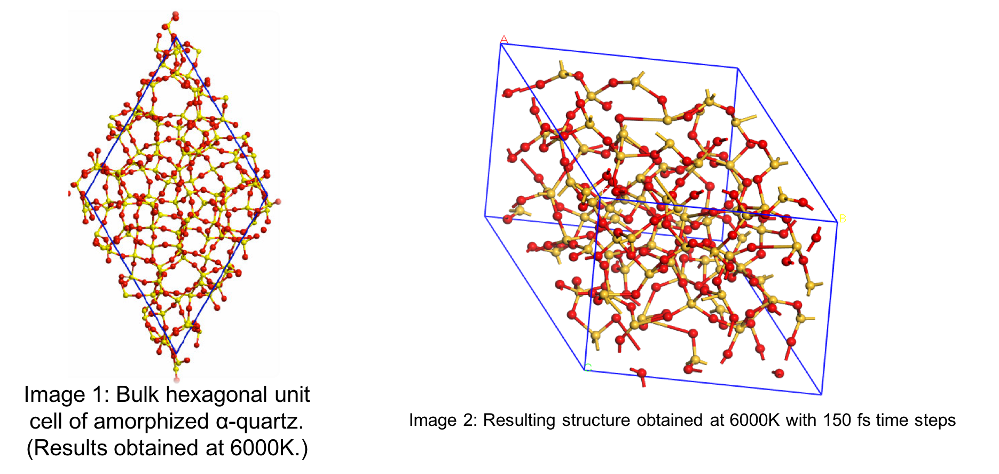
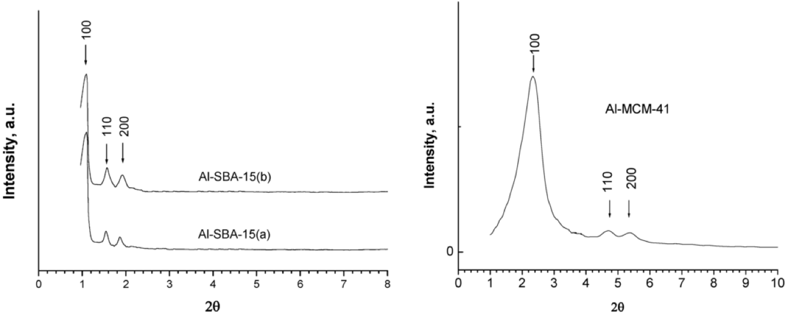

-------


```{r setup1, include=FALSE}
knitr::opts_chunk$set(echo = FALSE)
E_step <- readxl::read_excel("Report1/DATA/Aneal_energies.xlsx")
Article_data <- readxl::read_excel("Report1/DATA/Article-data.xlsx")
Bond_angle <- readxl::read_excel("Report1/DATA/bond-angle.xlsx")
E_mq <- readxl::read_excel("Report1/DATA/energy-mQ.xlsx")
kpoint_bulk <- read.csv("Report1/DATA/K-point-Bulk-energy.csv")
ba_raw <- read.csv("Report1/Data/Bond_Angles_Raw.csv")
bgap <- readxl::read_excel("Report1/Data/amorph_bandgap.xlsx")

Sys.setenv(TZ="Africa/Johannesburg")

library(reedtemplates)
library(chemistr)
library(png)
library(captioner)
fig_nums <- captioner()
table_nums <- captioner(prefix = "Table")
```

# Introduction
Grubbs catalysts for alkene metathesis have a vast range of advantages, but the fact that these catalysts are homogeneous makes extraction of the catalyst from the post-reaction mixtures very difficult. Because of cost implications, the re-use of the catalyst became very important [@RN88].

A heterogeneous catalyst can be a solution to the above-mentioned issue. In general, the activity and selectivity of heterogeneous catalysts are lower than homogeneous catalysts, but the advantage of separation, recovery and recycling outweigh these shortcomings.

According to literature mesoporous support materials, are ideal heterogeneous support materials [@RN92],[@RN44]. In this study, we decided to focus on the SBA-15 and MCM-41 mesoporous support material.

The first step in modelling a SBA-15 or MCM-41 mesoporous surface is to create an amorphous SiO2 bulk using an alpha-quartz (space group 180). [@RN44] The 3X3X3 super cell was submitted to dynamics studies using Materials Studio's CASTEP module and VASP 5.3 [@RN96],[@RN13]. This was done and I will discuss the procedure that I followed to accomplish this.

# Experimental work 2017

## 1. Amorphous SiO~2~ Bulk
### 1. Method:
A 3x3x3 alpha-quartz, space group 180, super-cell was built in the Materials Studio
software package.

1. The annealing process of the alpha-quartz to obtain an amorphous solid was
simulated using the CASTEP dynamic study module of the Materials Studio
software package.

2. The bulk was heated to 4000, 5000 and 6000K in 50, 100 and 150 steps of 1fs
each. After the heating step, the bulk was quenched to 1K in two 1fs steps.

3.  Each resulting structure was again heated to 1000K in the same number of steps
as in the first heating step and finally cooled down to 300K in the same number
of steps.

The resulting structures (Figure 2) was each submitted to a DFT calculation to
determine various indicating properties. The calculated and measured properties
included:

 + Energy
 
 + Bond Angles
 
 + Density of states [@RN96]
 
### 2. Results:
According to [@Rep1] if Alpha Quartz are melted and cooled down very quickly it will preserve the structure obtained during the melting phase, it is also seened in (`r table_nums("energy", display = "cite")`) and in the results that will follow. We will focus only on the results obtained during the melting and quenching steps and compare these results to experimental data.

##### .

#### Energy diviation
```{r Table:Energy diviation, echo=FALSE, fig.height=3, fig.width=3, message=FALSE, warning=FALSE, paged.print=FALSE}
library(knitr)
options(kableExtra.latex.load_package = FALSE)
library(kableExtra)
dt <- E_mq[-1,]  #data.frame
#str(dt) Get the structure om die kolom name te kry

kable(dt[, c("X__1","Melting","Quenching","Anealing","Cooling") ], row.names = FALSE, col.names = c("Step","Melting", "Quenching","Anealing", "Cooling"), booktabs = T) %>%
   kable_styling(latex_options = "striped") %>%
  row_spec(2:3, bold = T, color = "white", background = "red")
table_nums(name = "energy", caption = "Energy diviation.", display = FALSE)

```

####### `r table_nums("energy")`

#### Energy diviation during the melt and quenching steps

```{r Graph: Energy diviation MQ, echo=FALSE, fig.height=4, fig.width=5, message=FALSE, warning=FALSE, paged.print=FALSE}
library(ggplot2)


mdata <- reshape2::melt(E_mq, id.vars="X__1", 
                      measure.vars=c("Melting", "Quenching"))
 
 ggplot(data =  mdata, aes(x = X__1, y = value, group=variable, color=variable)) + geom_line() + 
  labs(title = "Energy Diviation for Melting and Quenching", x = "Step", y = expression(Delta*"E")) + theme_bw() +
  theme(axis.text.x = element_text(colour = "grey20", size = 12, angle = 90, hjust = 0.5, vjust = 0.5),
        axis.text.y = element_text(colour = "grey20", size = 12),
        text = element_text(size = 11))
 
 fig_nums("energy", "Energy per experemental step", display = FALSE)
```


####### `r fig_nums("energy")`

##### .

```{r Graph: Bandgap Melt Quenching, message=FALSE, warning=FALSE, paged.print=FALSE}
mdata <- reshape2::melt(bgap, id.vars="Set", 
                      measure.vars=c("Melt","Quench"))
#Hier organiseer die tabel om die plot te trek. Trek uit E_step id.vars is die groep en dan die res wat gemeet word
#Kyk na mdata en doen dan die grafiek. Onthou vir lyn grafieke moet daar 'n groep wees en die kleur. Hierdie is slegs nodig vir baie lyne op een grafiek
 
 ggplot (data =  mdata, aes(x = Set , y = value, group=variable, color=variable))+geom_point(size=3)+geom_line() + 
  labs(title = "Bandgap during Melting and Quenching steps", x = "Step", y = "Bandgap") + theme_bw() +
  theme(axis.text.x = element_text(colour = "grey20", size = 12, angle = 90, hjust = 0.5, vjust = 0.5),
        axis.text.y = element_text(colour = "grey20", size = 12),
        text = element_text(size = 11))
 
 
fig_nums("bandgap", "Bandgap during Melting and Quenching steps", display = FALSE)
```

####### `r fig_nums("bandgap")`

As we expected (`r fig_nums("bandgap", display = "cite")`) conclude that the band gap decreases as the temperature and reaction time increase. Therefore as the alpha-quartz become amorphous, there is also an increase in reactivity as seen in (`r fig_nums("energy", display = "cite")`). 


#### Bond Angle diviation

```{r Table: Delta-bond angle , message=FALSE, warning=FALSE, paged.print=FALSE}
 deltaBA <- ba_raw %>%
  mutate(deltaM = abs(M-Alpha),
         deltaQ = abs(Q-Alpha),
         deltaA = abs(A-Alpha),
         deltaC = abs(C-Alpha))

kable(deltaBA[, c("Step","deltaM","deltaQ","deltaA","deltaC") ], row.names = TRUE, col.names = c("Step","$\\Delta\\theta$ Melting", "$\\Delta\\theta$ Quenching","$\\Delta\\theta$ Annealing","$\\Delta\\theta$ Cooling"), booktabs = T) %>%
  row_spec(1, bold = T) 

 
table_nums("bond-angle", "Bond angle diviation", display = FALSE)

```

####### `r table_nums("bond-angle")`

##### .

### 3. Experimental data

```{r Table: Experimental, echo=FALSE, message=FALSE, warning=FALSE, paged.print=FALSE}
library(knitr)
options(kableExtra.latex.load_package = FALSE)
library(kableExtra)
library(magick)

dt <- Article_data[]

kable(dt[, c("X__1","deg","eV") ], row.names = TRUE, col.names = c("Info","$\\Delta \\theta$ deg", "$\\Delta$ E"), booktabs = T) %>%
  row_spec(1, bold = T) 
table_nums(name = "exp", caption = "Literature results obtained at 4000K", display = FALSE)

```

####### `r table_nums("exp")`


```{r Image: Amorphious Silica, echo=FALSE, fig.align='center', message=FALSE, warning=FALSE, out.width='90%'}
# All defaults



fig_nums("exp", "Literature  vs Experimental structional results", display = FALSE)


```

####### `r fig_nums("exp")`[@RN96]

### 4. Conclusion

+ The bond angle deviation shown in (`r table_nums("bond-angle", display = "cite")`) can be related to experimental data obtained as seen in (`r table_nums("exp", display = "cite")`). 
+ At 4000K the $\Delta$Ε correlate with the experimental values obtained in (`r table_nums("exp", display = "cite")`).

##### .

## 2. Modeling SiO~2~ surface

To do surface calculations it became very difficult, using the amorphous SiO2 bulk. We decide to use a crystalline 3X3X3 SiO2 bulk, using VASP 5.3. An Ab Initio Molecular Dynamics study will be done on all surfaces using VASP 5.3.

### K-point convergence for bulk SiO~2~ (Alpha Quartz) 

```{r Graph:K-point convergence, echo=FALSE, fig.height=3, fig.width=4}
Sys.setenv(TZ="Africa/Johannesburg")

library(ggplot2)

#Net een lyn grafiek
 
 ggplot(kpoint_bulk, aes(x=Point,y=E ))+geom_point(size=3)+geom_line()+
  labs(title = "Energy per K-point", x = "Kpoint", y = "Energy") + theme_bw()

 
fig_nums("kpoint1", "Energy per K-point", display = FALSE)
  
```

### SiO~2~ surface characterristics
The following surface characteristics will be determined

1. Cutting planes: I will focus on the planes (100,110,200) as indicated in the XRD results see (`r fig_nums("planes", display = "cite")`)
   
```{r Image: XRD Data , echo=FALSE, fig.align='center', message=FALSE, warning=FALSE, out.width='90%'}
# All defaults



fig_nums("planes", "XRD Data", display = FALSE)


```

####### `r fig_nums("planes")`

 * For each plane the following characteristics will be determined
 
    * Slab Thickness
 
    * Vacuum Gap size
 
    * Surface thickness (The number of unrelaxed surface layers)

2. Create a amorphous surface layer from the ideal surface determined from characteristics obtained above.

3. Compare the amorphous surface reactivate with the crystalline surface

##### .

## References


