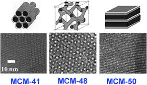
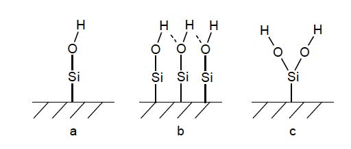

```{r setup, include=FALSE}
knitr::opts_chunk$set(echo = TRUE)
Sys.setenv(TZ="Africa/Johannesburg")
library(reedtemplates)
library(chemistr)
library(png)
library(jpeg)
library(captioner)
library(captioner)
fig_nums <- captioner(prefix = "Figure")
table_nums <- captioner(prefix = "Table")

lae <- read.csv("Data/Lae.csv", sep=";")
mplane <- read.csv("DATA/Snyvlakke.csv", sep=";")

f.ref <- function(x) {
  stringr::str_extract(fig_nums(x), "[^:]*")
}

```


#####

# Abstract

Three $\alpha$-Quartz ,space group 180, surfaces were modeled using crystallographic data from Pearson…. obtained in the Medea package database. Surface planes with miller indexes 100, 110 and 200 were cut from the bulk structure. The different surfaces were compared to identify the ideal MCM-41 surface to be used as a catalyst support.

# Introduction

The utilization of homogeneous catalysts in industry are limited, due to the fact that it is expensive to extract the catalyst from post-reaction mixtures [@RN44], [@RN90]. Research especially in the pharmaceutical and petrochemical industries took an interest in the immobilization or heterogeneous of a homogeneous catalyst as a possible solution to the mentioned problem. 

Although the activity and selectivity of heterogeneous catalytic reactions are lower than homogeneous reactions,  the advantage of separation, recovery and recycling outweigh these shortcomings. It is however important to ensure that the effectiveness of the immobilized homogeneous catalyst is not dramatically compromised [@RN90], [@RN73]. Therefore the main objective in the successful immobilization of homogeneous catalyst systems is to combine the high activity and selectivity properties of homogeneous catalysts with the ease of recovery of a heterogeneous catalyst. To accomplish this the selection of an appropriate support material is very important [@RN90]. 

Support materials can be divided into three categories e.g. insoluble organic, polymeric or inorganic supports. Immobilization by using insoluble organic supports involves ultra filtration techniques as seen in the separation of the PUK-Grubbs 2 catalyst by using organic solvent nano filtration [@RN73]. Van der Gryp et al. [@RN73] performed this separation using organic membranes and discovered that the catalyst can be successfully separated, but its lifetime was dramatically decreased during the filtration process [@RN73], [@RN90]. Polymer supports on the other hand provide easier filtration techniques, multiple coordination sites and the possibility to incorporate a molecular catalyst into the polymer structure. These are great advantages, but during the filtration process the thermal stability remains low [@RN90]. Inorganic supports have a high thermal stability, it provides for multiple coordination sites because it contains a large surface area (BET), big pores and narrow pore size distributions. Therefore inorganic supports are more effective in the immobilization of homogeneous catalysts systems than organic or polymeric support surfaces.[@RN44]

There are three types of inorganic supports available, which is categorized by their pore sizes and physical compositions:

1. Inorganic microporous support materials have pore sizes < 2nm, e.g. Zeolites, Metal-Organic Frameworks (MOFs);
2. Inorganic mesoporous support materials have pore sizes in the range of 2-15 nm, e.g. MCM-41, SBA-15 and Aerogels; and 
3. Inorganic macroporous support materials have pore sizes greater than 50 nm, e.g. glasses. [@RN44], [@RN90] 

Although microporous and macroporious support materials have the ability to be used as heterogeneous support, it doesn’t have an industrial appeal yet [@RN44],[@RN90]. Therefore the focus is on mesoporous support materials. Since the successful synthesis of mesoporous materials by Mobil in 1992, the research field in using and synthesizing mesoporious materials as support materials for heterogeneous catalytic reactions has grown significantly. The original synthesis of mesoporous support material was defined as the M41S family containing hexagonal MCM-41, cubic MCM-48 and lamellar MCM-50 structures. A more visual representation of the different structures can be seen in `r fig_nums("intro1", display = "cite")`

```{r Image: Mesoporous structures, echo=FALSE, fig.align = 'center', message=FALSE, warning=FALSE, out.width='90%'}

# All defaults

fig_nums("intro1", "Different structures of the M41S family", display = FALSE)

```

####### `r fig_nums("intro1")` [@RN87]

Unfortunately M41S materials have a limitation in pore diameter, approximately 80 Å, which affects the separation of large molecules [@RN89]. Zhao et al. [@RN69] extended the family of inorganic mesoporous support materials by synthesizing Santa Barbara Amorphous (SBA) type materials, with a pore diameter ranging between 20 to 300 Å.

## Surface characterization
The surface of mesoporous support materials are amorphous and contain accessible hydroxyl groups. This makes immobilization of homogeneous complexes on the silica surface possible [@RN90]. The crucial factor for immobilization of a catalyst on the silica surface is the concentration, distribution and accessibility of the silanol groups on the silica surface [@RN44]. Ramírez et al. [@RN75] showed that the types of silanols present on the silica surface are single, hydrogen bonded or germinal silanol groups as shown in `r fig_nums("intro2", display = "cite")`.


```{r Image:Silanol_groups, echo=FALSE, fig.align='center', fig.cap=intro2_cap, fig.width=1, message=FALSE, warning=FALSE, paged.print=TRUE, out.width='100%'}
   

intro2_cap <- fig_nums(name = "intro2", caption = "Different silanol groups on the surface of a silica support: (a) single, (b) hydrogen bonded and (c) geminal silanol groups \\[@RN75]", display = FALSE)
```

####### `r fig_nums('intro2')`

Coordination of the metal complexes to the support can either take place by binding of the metal ions directly or via organic molecule linkers to the silanols. Sels and co-workers [@RN74] observed that a weak physical interaction between a neutral Hoveyda-Grubbs- II type complex and the inorganic support was enough to separate the complex from the mixture and altered surfaces using linkers was not necessary. Cabrera et al. [@RN84] and Schachner et al. [@RN85] also found that ruthenium-based metathesis catalysts containing a hemilabile pyridine-alkoxide ligand adsorb extremely well onto an unmodified silica support without compromising too much on the homogeneous catalytic effectiveness.

# Experimental

## Determine the ideal miller plane
The $\alpha$-Quartz space group 180 unit cell, obtained from Pearson’s database available in the Medea software, was used to model the 3X3X3 SiO2 bulk structure. The bulk structure was optimized and according to XRD data [@######] the ideal surfaces that need to be cut from the bulk are those with miller indexes 100,110 and 200.

However, it is important to keep the effect of a dipole moment perpendicular to the surface in mind before cutting the bulk. If the surface is charged e.g. a dipole is present perpendicular to the surface, this surface can only be stabilized with substantial reconstruction. Therefore it is important to have a neutral surface layer, with an equal number of anions and cations on each plane. Metadise was used to cut the bulk structure into three neutral surfaces with miller indexes 100, 110 and 200 accordingly.


```{r Graph:millerplanes, echo=FALSE, message=FALSE, warning=FALSE, paged.print=TRUE,out.width='100%'}
mplane <- read.csv("DATA/Snyvlakke.csv", sep=";")

Sys.setenv(TZ="Africa/Johannesburg")

library(ggplot2)

#Net een lyn grafiek
 
 ggplot(mplane, aes(x=Plane,y=Energy,group=1 ))+geom_line()+geom_point(size=3)+labs(title = "Energy per miller plane", x = "Miller plane", y = "Energy") + theme_bw()

 
fig_nums("mplane", "Energy per Miller Plane", display = FALSE)

```

####### `r fig_nums('mplane')`

## Determine the ideal number of surface layers
To determine the ideal surface thickness we need to increase the surface thickness by adding surface layers and keep the vacuum gap the same over the different surfaces. A 18Å vacuum gap was used for all calculations because this is the minimum gap size required for the coordination of the Puk Grubbs 2 molecule, that will be performed in a later study. 

```{r Graph:fixgap, include=TRUE, echo=FALSE, message=FALSE, warning=FALSE, paged.print=TRUE,out.width='100%'}

fgap <- read.csv("Data/fixedgap.csv", sep=";")

fgap <- transform(fgap, eatom = (Energy / Num_atoms))


Sys.setenv(TZ="Africa/Johannesburg")

library(ggplot2)

#Net een lyn grafiek
 
 ggplot(fgap, aes(x=Layers,y=eatom,group=1 ))+geom_line()+geom_point(size=3)+labs(title = "Energy per Number of surface layers ", x = "Layers", y = "Energy per atom") + theme_bw()

 
fig_nums("fixgap", "Energy per Surface layer for a fixed gap size", display = FALSE)

```

####### `r fig_nums('fixgap')`

In the results see graph `r fig_nums("fixgap", display = "cite")` , 1 and 2 surface layers have almost the same energy, 3 layers never reach convergence and 4 layers result was out of bound. From this results, we conclude that the vacuum gap has a definite influence on the surface stability. From the literature, was learned that there is a relation between the surface thickness and the vacuum gap and it is approximately 1:3.[7]  The calculation results obtained from this study have shown that in keeping the vacuum gap size to 18A the relation between the surface thickness and vacuum gap size was between 1:1.4 and 1:0.7. 

## Determine the ideal surface thickness and vacuum gap relation
In this section, the relation between the slab thickness size and the vacume gap changed and the number of surface layers will be kept the same, that will determine the ideal vacuum gap size ratio.

```{r Graph:gap-rel, include=TRUE, echo=FALSE, message=FALSE, warning=FALSE, paged.print=TRUE,out.width='100%'}

grel <- read.csv("Data/Gap-relation.csv", sep=";")


Sys.setenv(TZ="Africa/Johannesburg")

library(ggplot2)

#Net een lyn grafiek
 
 ggplot(grel, aes(x=Relation,y=Energy,group=1 ))+geom_line()+geom_point(size=3)+labs(title = "Energy per vacume gap, surface layer relation ", x = "Relation", y = "Energy for 1 layer") + theme_bw()

 
fig_nums("gap-rel", "Vacume Gap, Surface thickness relation", display = FALSE)

```

####### `r fig_nums('gap-rel')`

In correlation with literature a vacume gap , surface thickness relation of 1:3 was espected as the the ideal ratio. As seen from the results `r fig_nums("gap-rel", display = "cite")` a relation of 1:2.8 was calculated, and is inbound with literature

Instead of keeping the vacuum gap size the same for all calculations it is more feesable to keep the relation between the surface thickness and vacuum gap the same. The different energy calculations for the different surface thickness were recalculated with a relation of slab thickness size to vacuum gap size of 1:1.4. 


```{r Graph:layers, include=TRUE, echo=FALSE, message=FALSE, warning=FALSE, paged.print=TRUE,out.width='100%'}

lae <- read.csv("Data/lae.csv", sep=";")

lae <- transform(lae, eatom = (Energy / num.atoms))


Sys.setenv(TZ="Africa/Johannesburg")

library(ggplot2)

#Net een lyn grafiek
 
 ggplot(lae, aes(x=Layers,y=eatom,group=1))+geom_line()+geom_point(size=3)+labs(title = "Energy per Number of surface layers ", x = "Layers", y = "Energy per atom") + theme_bw()

 
fig_nums("layer", "Energy per Surface layer", display = FALSE)

```

####### `r fig_nums('layer')`

From the the graph `r fig_nums("layer", display = "cite")` we can see that a 2 layer surface has  the lowest energy, but the 0.3 energy difference between 1 and 2 layers and the time to complete a calculation for a surface layer of 13A and 26A is a differance of 48H and 120H. If we keep the calculation time and the fact that the largest surface layer used in literature is 12A, the calculations that will folow will use only one surface layer. 


# Results and discussion

\listoffigures


